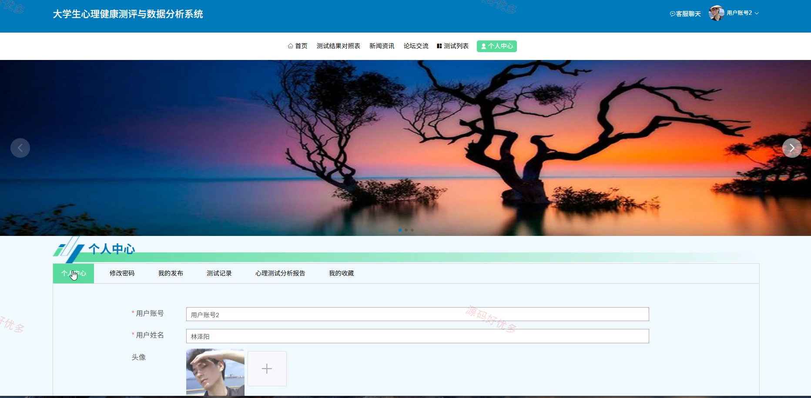
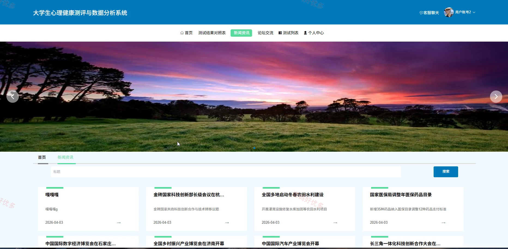
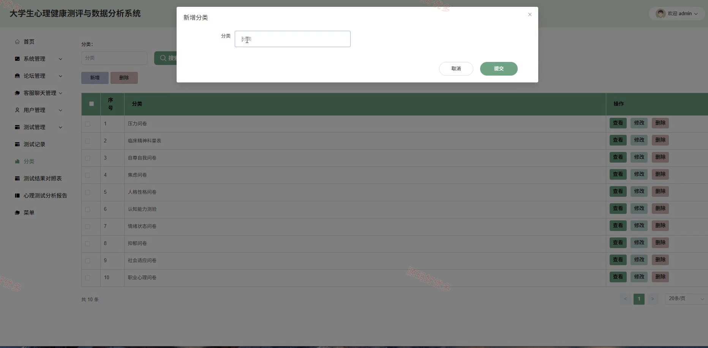
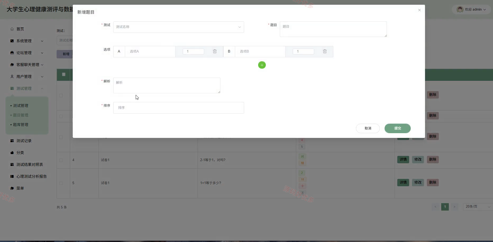
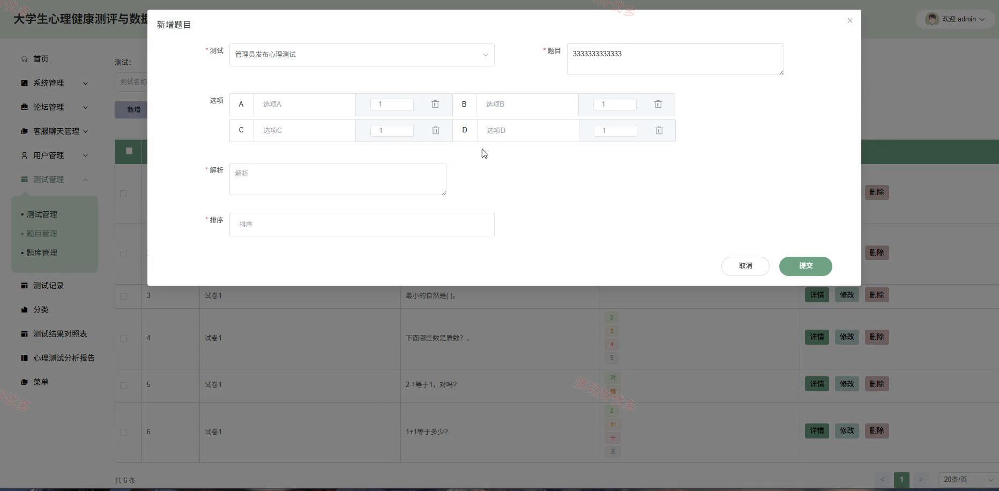
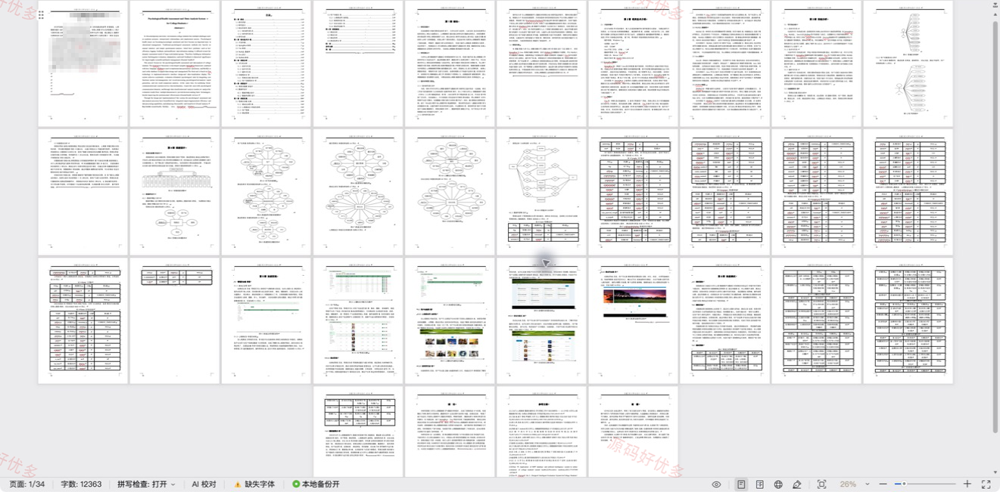

## 源码问题查看主页咨询

### 一、关键词
大学生心理健康测评与数据分析系统、大学生心理健康测评与数据分析、大学生心理健康测评与数据分析信息管理、大学生心理健康测评与数据分析后台管理

### 二、作品包含
源码+数据库+万字设计文档+PPT+全套环境和工具资源+本地部署教程

### 三、项目技术
前端技术： Html、Css、Js、Vue3.5、Element-Plus
后端技术：Java、SpringBoot3.3.0、MyBatis-Plus

### 四、运行环境（以下版本亲测，其他版本兼容性请自行测试）
开发工具：IDEA/eclipse + VSCODE

数据库：MySQL8.0+（共23张表）

数据库管理工具：Navicat10以上版本

环境配置软件： JDK17 + Maven3.6.3

前端Nodejs：16+

浏览器：谷歌浏览器

### 五、项目介绍
项目编号：springbootA663D

大学生心理健康测评与数据分析系统面向用户、管理员，提供测试结果对照表查看、新闻资讯查看、论坛交流管理、测试列表查看、我的发布查看、测试记录查看、心理测试分析报告查看等功能，实现各角色在系统中的实际业务协作。

角色：用户、管理员

用户功能：前台登录与注册、测试结果对照表查看与互动、新闻资讯查看、论坛交流与我的发布、心理测试与测试记录、心理测试分析报告查看与下载、我的收藏查看、个人中心维护。

管理员功能：后台登录、系统与菜单管理、论坛与客服聊天管理、用户管理、心理测试管理、测试记录管理、分类与测试结果对照表管理、心理测试分析管理。

### 六、运行截图

